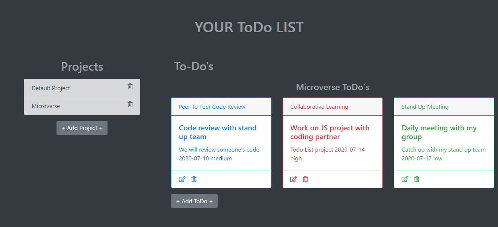
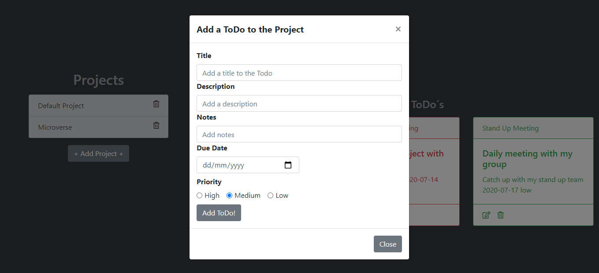

<!--
*** Thanks for checking out this README Template. If you have a suggestion that would
*** make this better, please fork the repo and create a pull request or simply open
*** an issue with the tag "enhancement".
*** Thanks again! Now go create something AMAZING! :D
-->

<!-- PROJECT SHIELDS -->
<!--
*** I'm using markdown "reference style" links for readability.
*** Reference links are enclosed in brackets [ ] instead of parentheses ( ).
*** See the bottom of this document for the declaration of the reference variables
*** for contributors-url, forks-url, etc. This is an optional, concise syntax you may use.
*** https://www.markdownguide.org/basic-syntax/#reference-style-links
-->
[![Contributors][contributors-shield]][contributors-url]
[![Forks][forks-shield]][forks-url]
[![Stargazers][stars-shield]][stars-url]
[![Issues][issues-shield]][issues-url]

# To-Do List

> An application built with JavaScript and Webpack where a user can add projects and track all the tasks of those projects.

Main Section

Modal to add ToDo´s

Additional description about the project and its features.

## Built With

- HTML
- CSS
- JAVASCRIPT
- WEBPACK
- BOOTSTRAP

## Live Demo

[Live Demo Link](https://raw.githack.com/kubilaycaglayan/todo-list/todo_list/dist/index.html)

## Getting Started

### Usage

- Click the Live Demo link and add Projects and Tasks to each project.

### Prerequisites

- A modern browser, up to date.

### Run tests

- There is no automated tests for this project.

## Future features

- Add extra fields and animations to the site.

## Authors

👤 Javier Oriol Correas Sanchez Cuesta
- Github: [@javitocor](https://github.com/javitocor)
- Twitter: [@JavierCorreas4](https://twitter.com/JavierCorreas4)
- Linkedin: [Javier Oriol Correas Sanchez Cuesta](https://www.linkedin.com/in/javier-correas-sanchez-cuesta-15289482/)

👤 **Kubilay Caglayan**

- Website: [kubilay](https://kubilaycaglayan.com)
- Github: [@kubilaycaglayan](https://github.com/kubilaycaglayan)
- Twitter: [@kbcaglayan](https://twitter.com/kbcaglayan)
- Linkedin: [linkedin](https://linkedin.com/in/kubilaycaglayan)

## 🤝 Contributing

Contributions, issues and feature requests are welcome!

Feel free to check the [issues page](https://github.com/kubilaycaglayan/todo-list/issues).

## Show your support

Give a ⭐️ if you like this project!

## Acknowledgments

- The Odin Project
- Microverse

## 📝 License

This project is [MIT](lic.url) licensed.

<!-- MARKDOWN LINKS & IMAGES -->
<!-- https://www.markdownguide.org/basic-syntax/#reference-style-links -->
[contributors-shield]: https://img.shields.io/github/contributors/kubilaycaglayan/todo-list.svg?style=flat-square
[contributors-url]: https://github.com/kubilaycaglayan/todo-list/graphs/contributors
[forks-shield]: https://img.shields.io/github/forks/kubilaycaglayan/todo-list.svg?style=flat-square
[forks-url]: https://github.com/kubilaycaglayan/todo-list/network/members
[stars-shield]: https://img.shields.io/github/stars/kubilaycaglayan/todo-list.svg?style=flat-square
[stars-url]: https://github.com/kubilaycaglayan/todo-list/stargazers
[issues-shield]: https://img.shields.io/github/issues/kubilaycaglayan/todo-list.svg?style=flat-square
[issues-url]: https://github.com/kubilaycaglayan/todo-list/issues
